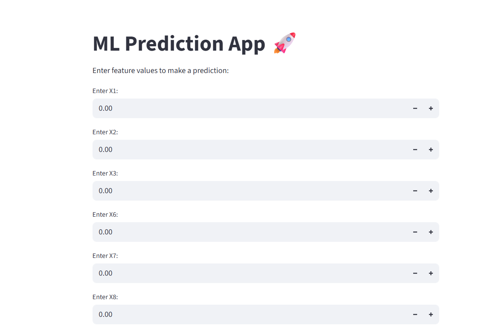
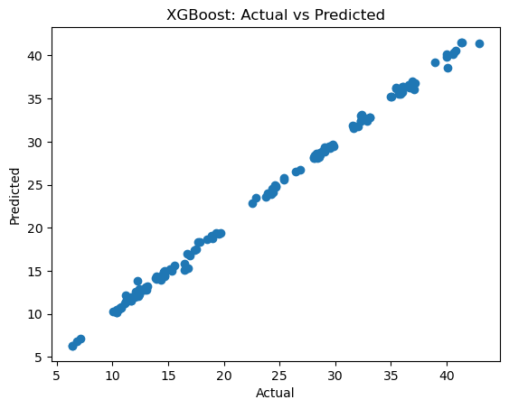

# 🏠 Energy Efficiency Prediction App  

A Machine Learning web application built with **Streamlit** to predict **Energy Efficiency (Y1)** based on building features (`X1, X2, X3, X6, X7, X8`).  
This project demonstrates **data preprocessing, model training, and deployment** in an interactive web app.  

---

## 🚀 Live Demo  
👉 [Try the App Here](https://huggingface.co/spaces/navaneethakrishnan1234/regression)  

---

## 📷 Screenshots  

🔹 **App Homepage**  
  

🔹 **Prediction Output**  
  

---

## 📊 Dataset Features  

- **X1** → Relative Compactness  
- **X2** → Surface Area  
- **X3** → Wall Area  
- **X6** → Orientation  
- **X7** → Glazing Area  
- **X8** → Glazing Area Distribution  
- **Y1** → Heating Load (Target)  

---

## ⚙️ Tech Stack  

- Python 🐍  
- Scikit-learn 🤖  
- Streamlit 🌐  
- Pandas / NumPy 📊  

---

## 📥 Installation  

Clone the repository and install dependencies:  

git clone https://github.com/nk/energy-efficiency-app.git
cd energy-efficiency-app
pip install -r requirements.txt

🏆 Results

Achieved accurate predictions for heating load (Y1).

Deployed as an interactive web app with real-time input sliders.

